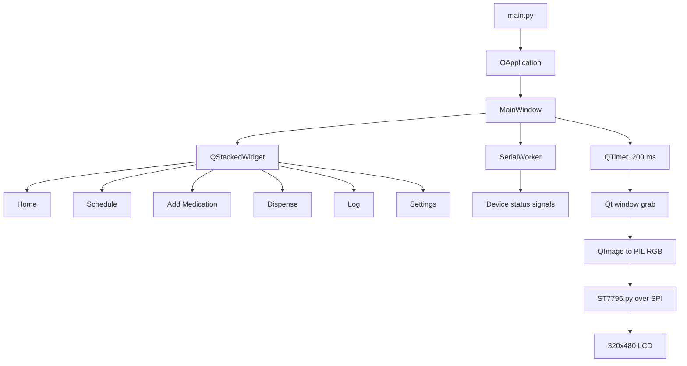

# Pillba Device UI

PyQt5 user interface for the Pillba medication dispenser. The application is designed for a Raspberry Pi connected to a 320x480 ST7796 graphical LCD and communicates with the dispenser controller over serial UART.

## Architecture



### Display pipeline

The ST7796 is driven directly over SPI by the bundled `ST7796.py` driver. It is not exposed as `/dev/fb0` or a DRM display, so the application does not use `linuxfb` or `eglfs` for the LCD.

In LCD mode:

1. Qt renders the normal widget tree using the `offscreen` platform.
2. `main.py` captures the 320x480 window every 200 ms.
3. `lcd_display.py` converts the Qt `QImage` to a PIL `RGB` image.
4. The image is passed to `ST7796.display()` and sent to the LCD as RGB565 data.

The UI also supports a normal desktop mode for development. In that mode Qt renders directly to the desktop display.

## Project structure

```text
pillba-device-ui/
├── main.py                # Application entry point and page navigation
├── lcd_display.py         # Qt QImage to PIL/ST7796 display bridge
├── ST7796.py              # SPI/GPIO display driver
├── serial_worker.py       # UART worker and device status signals
├── db.py                  # SQLite persistence helpers
├── styles.qss             # Qt stylesheet
├── pages/                 # Application screens
├── widgets/               # Reusable Qt widgets
├── schema/                # UART protocol definitions
├── shapes.py              # Standalone ST7796 hardware test
├── requirements.txt       # Python dependencies
└── pillba.sqlite3         # Local application database
```

## Hardware

The bundled ST7796 configuration in `lcd_display.py` is:

| Setting           | Value   |
| ----------------- | ------- |
| Resolution        | 320x480 |
| SPI bus           | 0       |
| Chip select       | 0       |
| Data/command GPIO | BCM 25  |
| Reset GPIO        | BCM 26  |
| SPI speed         | 16 MHz  |
| Rotation          | 0       |

Ensure the LCD wiring matches these values. If the wiring or display board differs, update the constructor in `lcd_display.py` and the driver configuration as required.

The project also expects five physical navigation buttons: Up, Down, Left, Right, and Select. The current page buttons support Qt mouse/touch interaction; GPIO button reading and directional focus navigation still need to be connected to the application.

## Raspberry Pi setup

Enable SPI:

```bash
sudo raspi-config
```

Select:

```text
Interface Options -> SPI -> Enable
```

Install the operating-system packages used by the hardware and Qt stack:

```bash
sudo apt update
sudo apt install python3-pyqt5 python3-pyqtgraph python3-pil \
	python3-numpy python3-serial python3-opencv \
	python3-rpi.gpio python3-spidev
```

Because Raspberry Pi OS may not provide a compatible PyQt5 wheel for every Python version and ARM combination, the system packages are preferred for Pi deployment.

Create a virtual environment that can see those system packages:

```bash
python3 -m venv --system-site-packages venv
source venv/bin/activate
```

If a package is not supplied by apt, install it separately:

```bash
python3 -m pip install Pillow pyserial pyqtgraph
```

Verify the important imports:

```bash
python3 -c "import PyQt5, PIL, numpy, spidev, RPi.GPIO; print('dependencies OK')"
```

## Running the application

### Desktop/development mode

This renders the UI in a normal Qt window:

```bash
python3 main.py
```

### ST7796 LCD mode

This forces Qt to render offscreen and sends frames to the LCD driver:

```bash
PILLBA_LCD=1 python3 main.py
```

Do not use this mode with `QT_QPA_PLATFORM=linuxfb:fb=/dev/fb0`. The direct SPI driver does not create `/dev/fb0`.

The application refreshes the LCD at approximately 5 frames per second. Full-frame SPI updates can be slow; the refresh interval can be adjusted in `main.py` if needed.

## Testing the LCD independently

`shapes.py` initializes the same ST7796 hardware and draws a test image using PIL. Run it before testing the PyQt bridge:

```bash
python3 shapes.py
```

If this test does not display correctly, resolve the SPI, GPIO, wiring, or driver issue before troubleshooting the Qt application.

## Troubleshooting

### `PyQt5` fails while preparing `pyproject.toml`

This usually means pip is trying to build PyQt5 from source because no compatible wheel is available. Install `python3-pyqt5` with apt and recreate the virtual environment using `--system-site-packages` as described above.

### `/dev/fb0` is missing

That is expected for this direct SPI setup. The ST7796 is controlled by `ST7796.py`, not by Linux framebuffer or DRM. Use:

```bash
PILLBA_LCD=1 python3 main.py
```

### `No module named ST7796`

Confirm that `ST7796.py` is in the same directory as `main.py` and `lcd_display.py`:

```bash
ls ST7796.py lcd_display.py main.py
```

### SPI or GPIO import errors

Check that SPI is enabled and that the Pi-specific packages are installed:

```bash
ls -l /dev/spidev*
python3 -c "import spidev, RPi.GPIO; print('SPI/GPIO imports OK')"
```

### LCD is blank or rotated incorrectly

First run `shapes.py`. Then check the `width`, `height`, `rotation`, `rst`, `dc`, `port`, and `cs` values in `lcd_display.py`. The display driver converts frames to RGB565 internally.

## Development notes

- Keep the UI logical size at 320x480.
- Keep ST7796 hardware access out of page and widget modules.
- Use Qt signals for serial and future GPIO button events so hardware work does not block the GUI thread.
- Do not import `shapes.py` from the application; it performs hardware initialization and drawing immediately when executed.
